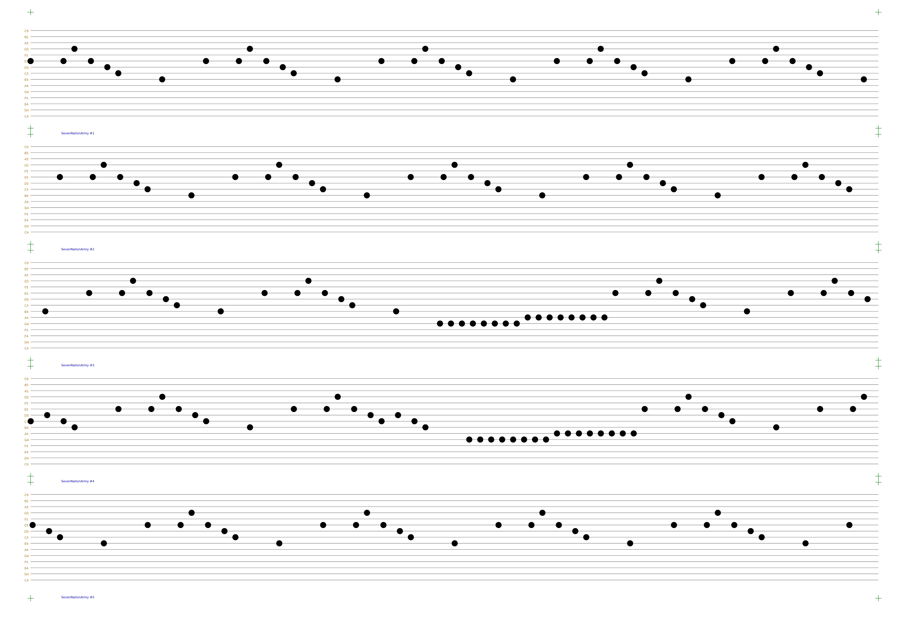

# punchline

CLI tool to generate SVG punch cards (stripes with melodies) for a DIY music box from MIDI melodies.

Some basics:

+ [SVG](https://en.wikipedia.org/wiki/Scalable_Vector_Graphics) is a vector format of images, meaning that you can scale the image as much as you want and print it on any printer, [pen plotter](https://all3dp.com/2/pen-plotters-best-xy-plotters/), or [laser cutter](https://en.wikipedia.org/wiki/Laser_cutting).
+ [MIDI](https://en.wikipedia.org/wiki/MIDI) is a sound format that instead of exact sounds describes which musical instruments should play which note at which moment. You can find a free MIDI file for any popular melody online.
+ [DIY music box](https://musicboxfun.com/guides/diy-music-box) is a type of music box which instead of playing a predefined melody can play any melody from a paper stripe with holes in it. You can buy one online for a pretty low price.

Features:

1. Written on modern Python.
1. Has friendly CLI.
1. Well documented source code (if you really want to tweak something).
1. Highly configurable.
1. Has only necessary dependencies.
1. Automatically finds the best transposition.
1. Finds the best fit for notes that aren't present on the music box.
1. Supports all kinds of music boxes.
1. Works offline.

## Output example

Seven Nation Army for 15 notes music box:



## Installation

You'll need:

1. [Python](https://www.python.org/) version 3.9 or later
1. [pip](https://pip.pypa.io/en/stable/)
1. Knowledge of how to use [terminal](https://en.wikipedia.org/wiki/Terminal_emulator).

```bash
python3.9 -m pip install punchline
```

## Usage

Get help:

```bash
python3.9 -m punchline --help
```

Generate punch cards from 3rd track in [SevenNationArmy.mid](https://freemidi.org/download3-3953-seven-nation-army-white-stripes) for 35-notes music box that supports sharp notes and save the result into "7nation" directory:

```bash
python3.9 -m punchline --input SevenNationArmy.mid --tracks 3 --sharps --notes-count 35 --output 7nation
```

The only required argument is `--input`. By default, it will generate stripes from all tracks for 15-notes non-sharp music box and store the result in the "output" directory.

## Editing tips

1. You can use [Inkscape](https://inkscape.org/) to edit generated SVG images. It's free and powerful.
1. To mass-edit a specific type of element:
    1. Select an element of this type
    1. Right-click on it.
    1. Open "Select same" menu.
    1. Select "Fill and stroke"
1. Red circles indicate sounds that aren't perfectly fit on the music box. They are either in a different octave comparing to most of the other sounds or they are semitones (sharp notes) when your music box doesn't support semitones. Punchline tries its best to place them where it will sound OK but you may want to edit them or remove altogether.
1. Pay attention to the sounds that have the same note and go close to each other. The second one might be silent because of limitations of the music box. You may want to decrease the `--speed` for the whole melody or manually move (or remove) colliding sounds.

## Acknowledgments

1. The initial implementation is based on [punchbox](https://github.com/psav/punchbox).
1. [mido](https://mido.readthedocs.io/en/latest/) is used to read MIDI files.
1. [svg.py](https://github.com/orsinium-labs/svg.py) is used to generate SVG files.
